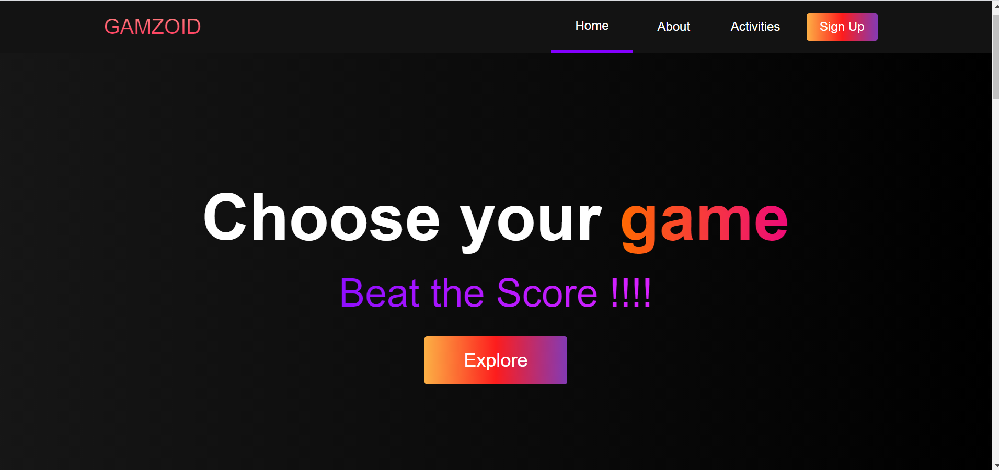
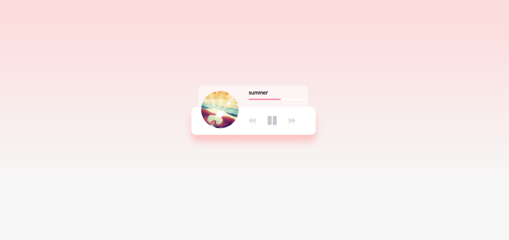

# Gamzoid - (Virtual Store for Games and lot more)

A web application that allows users to play different online games at one place instead of looking out for separate apps . Also developers across the community can make useful contributions to the project . Currently the project is maintained by [Piyush ](https://github.com/piyush7-10) and [Kashish](https://github.com/Kashish0423) and hosted at
[Gamezoid](https://piyush7-10.github.io/Virtual-Store/) .

### This is a Vanilla Javascript based web application

To get started and run the app:

- Clone the project.
- In case you use VScode , use the [Live Server Extension](https://marketplace.visualstudio.com/items?itemName=ritwickdey.LiveServer) and open up the **index.html** page to view the complete project , you can also open HTML files of separate Directories in the project to open them separately using the live server .
- For other editors , use any suitable way to view the project .

Features Of the application:

- Responsive navigation bar that allows user to navigate back and forth the website with ease
- App has separate section for Home , About, Activites and SignUp .
- Activites is the part where the fun begins and we have lot of fun for our users
- **Snake Game**- Traditional snake game but with modern sound and use of **requestanimationframe** for smooth performance throughout, beautified snake and a lot more .
- **MineSweeper** - Test out your luck and let us know if you can get a "You Win" once the game finishes .
- **Music Player** - Beautifully designed Music player currently supports only 3 songs ,but we have plans to extend it . A user can change the songs on fly, fast forward a song etc
- **Drum Kit** - Specially created for people who wish to be in a band some day but they couldn't , try to relive the feeling of playing drums just using your Keyboards /Mouse and have some fun

Snapshots of the project 👇

Home Section

About Section

Activities

Responsive Navigation Bar

Footer

Snake Game

MineSweeper

Running Music Player

Stopped Music Player

DrumKit

